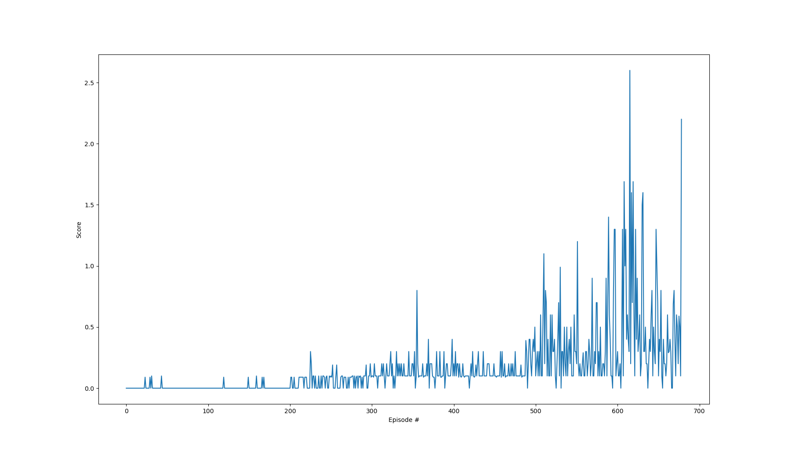

# Project 3: Collaboration and Competition

## Introduction

This Project uses the [Tennis](https://github.com/Unity-Technologies/ml-agents/blob/master/docs/Learning-Environment-Examples.md#tennis) environment which allows two agents to play tennis together.
The objective is to teach them to play... better!

### The Environment
In this environment, the observation space consists of 3 stacked frames with 8 variables each: xy-position and velocity for the racket and xy-position and velocity for the ball where each position and velocity is a two-vector.
Each racket may take an action in a two-dimensional space: move left or right, or move up or down.
Each frame is an instance of time where the most recent is the current state and each of the last two timesteps are the other two stacked states (respectively).
The action space is a two-vector that is bounded between -1 and 1 for both x and y movement.
Each episode ends when a point is scored.

In the game, two agents control rackets to bounce a ball over a net.
If an agent hits the ball over the net, it receives a reward of +0.1.
If an agent lets a ball hit the ground or hits the ball out of bounds, it receives a reward of -0.01.
The goal of each agent is to keep the ball in play.

### The Problem

The task training task is episodic, going point by point.
In order to solve the environment, the agents must get an average maximum score of +0.5 over 100 consecutive episodes (over 100 consecutive episodes, after taking the maximum over both agents).
That is, the score for each episode is the maximum score obtained by the two agents, and the average of the episode scores for 100 episodes must be greater than +0.5.

## Getting Started

1. Download the environment from one of the links below.  You need only select the environment that matches your operating system:
    - Linux: [click here](https://s3-us-west-1.amazonaws.com/udacity-drlnd/P3/Tennis/Tennis_Linux.zip)
    - Mac OSX: [click here](https://s3-us-west-1.amazonaws.com/udacity-drlnd/P3/Tennis/Tennis.app.zip)
    - Windows (32-bit): [click here](https://s3-us-west-1.amazonaws.com/udacity-drlnd/P3/Tennis/Tennis_Windows_x86.zip)
    - Windows (64-bit): [click here](https://s3-us-west-1.amazonaws.com/udacity-drlnd/P3/Tennis/Tennis_Windows_x86_64.zip)

    (_For Windows users_) Check out [this link](https://support.microsoft.com/en-us/help/827218/how-to-determine-whether-a-computer-is-running-a-32-bit-version-or-64) if you need help with determining if your computer is running a 32-bit version or 64-bit version of the Windows operating system.

    (_For AWS_) If you'd like to train the agent on AWS (and have not [enabled a virtual screen](https://github.com/Unity-Technologies/ml-agents/blob/master/docs/Training-on-Amazon-Web-Service.md)), then please use [this link](https://s3-us-west-1.amazonaws.com/udacity-drlnd/P3/Tennis/Tennis_Linux_NoVis.zip) to obtain the "headless" version of the environment.  You will **not** be able to watch the agent without enabling a virtual screen, but you will be able to train the agent.  (_To watch the agent, you should follow the instructions to [enable a virtual screen](https://github.com/Unity-Technologies/ml-agents/blob/master/docs/Training-on-Amazon-Web-Service.md), and then download the environment for the **Linux** operating system above._)

2. Place the file in the DRLND GitHub repository, in the `p3_collab-compet/` folder, and unzip (or decompress) the file.

## Repository Anatomy

### main.py
When all dependencies are installed, executing `python main.py` will train the agents using the ddpg algorithm.
The script will save four checkpoint files (one for the actor and one for the critic for each agent) if the problem is solved: 100 consecutive episodes with an average score greater than or equal to +0.5.
These files take the format `checkpoint-actorX.pth` and `checkpoint-criticX.pth` where X is either 0 or 1 depending on which agent did the saving.

### demo.py
Running `python demo.py` will execute a demonstration with the trained agents (including both actor and critic networks).
It should be noted that the environment was solved after 579 episodes yielding an average score of `0.52` over the subsequent 100 consecutive episodes: there is NO GUARANTEE that any randomized run will yield a score greater than 0.5!
Evidence of the solution can be seen in the graphic below.

### ddpg.py
This file contains the code for training the agent after both the actor and critic networks have been configured.
It also includes the class that generates the Ornstein-Uhlenbeck noise added to the actions.
Most of this class was directly reused from Project 2: Continuous Control, excepting the hyperparameters which are detailed in [the report](Report.md)

### model.py
This file contains the pytoch-based neural network logic to set up the actor and critic which are used for both player agents.
This is also mostly a reuse from Project 2 except that it is now possible to make two agents share the same `ReplayBuffer` for training purposes, and the shapes of the networks have changed.
The actor and critic agents both now have a first hidden layer with 512 nodes and a second hidden layer with 256 nodes.
