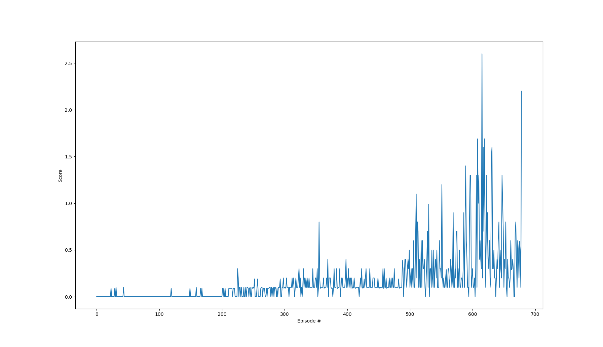

# Overview

This project uses pytorch to implement Deep Deterministic Policy Gradient (DDPG) with replay to solve a tennis playing Unity environment.
The goal of the environment is to keep a tennis ball in play, and it contains two agents that control each racket.
Each time the ball is kept in play, a reward of +0.1 is given, and each time it hits the bround or goes out of bounds a reward of -0.01 is given.

In this environment, the observation space consists of 3 stacked frames with 8 variables each: xy-position and velocity for the racket and xy-position and velocity for the ball where each position and velocity is a two-vector.
Each racket may take an action in a two-dimensional space: move left or right, or move up or down.
Each frame is an instance of time where the most recent is the current state and each of the last two timesteps are the other two stacked states (respectively).
The action space is a two-vector that is bounded between -1 and 1 for both x and y movement.
Each episode ends when a point is scored.

A straightforward solution was crafted by sharing a replay buffer (unweighted) between both player agents, using only the most recent position and velocity information for each agent and the ball, and a small amount of Ornstein-Uhlenbeck action noise added for soft network updates each timestep.

# Scenario
After the environment has been initially configured, the agent is trained until success is reached or 6500 episodes elapse (set by me).
Each episode is allowed to last only 1000 timesteps (which is extremely too long considering the ball hits the ground often when early in training) or when the environment signals that the episode is done.

## Neural Network Design
The neural network used for this solution is crafted using the torch package (pytorch).
In particular, the input state passes through two hidden layers, one with 256 nodes and the second with 512 nodes for both the actor and critic of each agent.
The actor uses this network to predict actions, and the critic uses a network of this shape to predict the value of a state and action pair.

Rectified linear activation (ReLU) is used generally as an activation function for the layers of these networks, though the last layer in the actor network uses hyperbolic tangent since all actions (up/down or left/right) must have values between -1 and 1.
Gradient ascent is used with backward propagation.

The learning-rate for this propagation (loosely, the length of the step of the stochastic gradient ascent) was 1e-3 for the actor and 1e-3 for the critic for each agent using the Adam optimizer.

Once enough training timesteps were acquired to satisfy the batch size (256 measurements) learning was run on a random sample once each time step.

## Selected Hyperparameters
| Parameter   | Value |
| ----------- | ----------- |
| Buffer Size | 1,000,000       |
| Batch Size  | 256        |
| Discount Factor | 0.99 |
| Soft Update Parameter| 0.999 |
| Actor Learning Rate (both players) | 1e-3 |
| Critic Learning Rate (both players)| 1e-3 |
| L2 Weight Decay | 0 |
| Network Update Rate | each possible timestep |

# Outcome
**This agents were able to train to the success criterion in 579 episodes.**  The result of that training can be seen below.

# Future Work
I was honestly pretty surprised to have trained the agents so quickly with only a cursory examination of hyper parameters and and underwhelmingly simple view on the observations.
In this project, I discarded the stacked observations in favor of only the current position and velocity of each agent and the ball.
It stands to reason that, by leveraging these other states in the stack like in the atari training problem, it would be possible to train more effectively.
It would also be better to use a weighted sampling from the replay buffer: the sampling I used was totally random and unweighted, which again is not optimal.
The training rate could also have been changed.
I used a soft update each timestep once there was a full batch of data (256 observations recorded in memory), but I could have played several timesteps and then did a batch of learning.
This was demonstrated to be more effective in the discussion of Project 2: continuous control.

All told, I'm pleasantly surprised I got successful training so quickly, but it came with comparatively less effort than the other projects!
